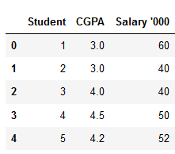
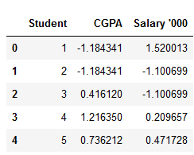
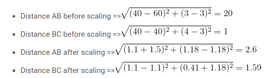
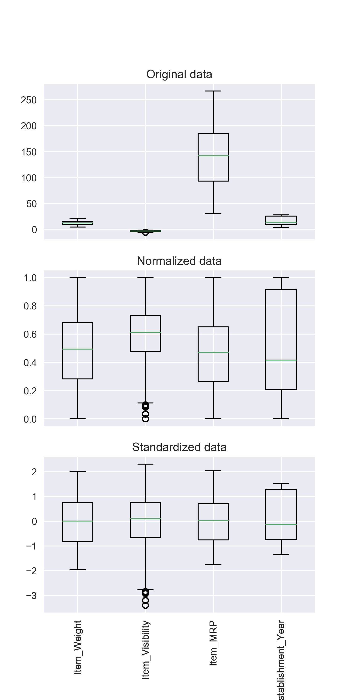
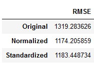
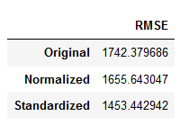
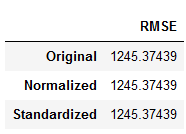

# Feature Scaling for Machine Learning: Understanding the Difference Between Normalization vs. Standardization

https://www.analyticsvidhya.com/blog/2020/04/feature-scaling-machine-learning-normalization-standardization/

Feature scaling é colocar suas features em mesma magnitude. Mas porque alguns modelos ganham em perfomance quando as features são esacaladas e outros não? Qual a diferença entre scaling e standardization? Quando devo usar cada uma dessas técnicas?

O artigo vai atacar os seguintes tópicos:
1. Why Should we Use Feature Scaling?
2. What is Normalization?
3. What is Standardization?
4. The Big Question – Normalize or Standardize?
5. Implementing Feature Scaling in Python
    >Normalization using Sklearn
    
    >Standardization using Sklearn
6. Applying Feature Scaling to Machine Learning Algorithms
    >K-Nearest Neighbours (KNN)
    
    >Support Vector Regressor
    
    >Decision Tree

## Respostas

1. Alguns modelos são sensíveis a diferença de escala do nosso dataset e por isso devemos utilizar o scaling, para previnir que uma feature seja mais importante que a outra por esse simples fato.

**Algoritmos que utilizam SGD(stochastic gradient descent) precisam das features em uma escala única para convergirem mais rápido.**

**Algoritmos baseados em distância como KNN, KMEANS, SVM, precisam das features em uma escala única afinal de contas eles estão medindo a distância entre cada feature.**

Os dados acima demonstram a nota de cada estudando e o salário deles em 1000k.A feature salário vai ter um peso maior por conta de sua escala, afetando negativamente nosso modelo o deixando enviesado.

Após aplicar scaling nos dados podemos verificar a grande diferença na distancia entre os pontos.

**ALGORITMO BASEADOS EM ÁRVORE SÃO BASTANTE INSENSÍVEIS A ESCALA DAS FEATURES, VISTO QUE ELES SOMENTE TOMA A DECISÃO DE SPLITAR UM NODE LEVANDO EM CONSDIERÇÃO UMA FEATURE DE CADA VEZ, LOGO UMA FEATURE NÃO INFLUENCIA NA OUTRA**

2. Normalização é uma técnica de scaling a normalização modifica os valores para que fiquem entre 0 e 1. O algoritmo mais conhecido é o MinMaxScaler.

3. Standardization (padronização??) é outra técnica de scaling onde os valores são construídos ao redor da média com desvio padrão igual a uma unidade. Isso faz com que a média seja zero. Um algoritmo bem conhecido é o StandardScaler.

4. Normalização é boa quando sabemos que a distribuição do model NÃO segue uma curva gaussiana. Isso é bom quando temos modelos que não assumem a distribuição dos seus dados. (KNN ou redes neurais). Standardization é para quando os dados seguem uma distribuição normal, porém essa condição não é estritamente necessária. Aqui o artigo fica bem vago e fala que o melhor é testar as duas técnicas.

Resultados em uma KNNRegressor.

Resultados em uma SVR.

Resultados numa DecisionTree (LOL).

Daqui pra frente é melhor testar os dois e ver qual tem o melhor resultado então.