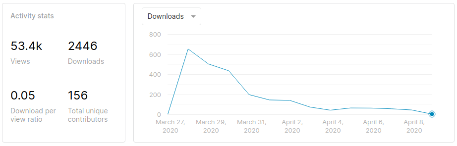
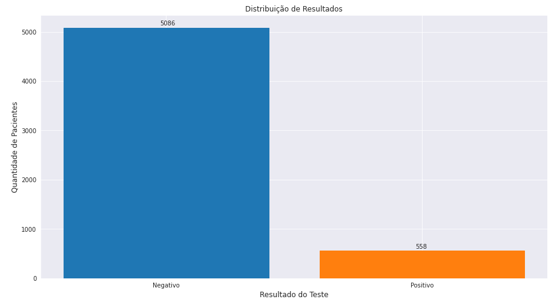
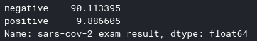
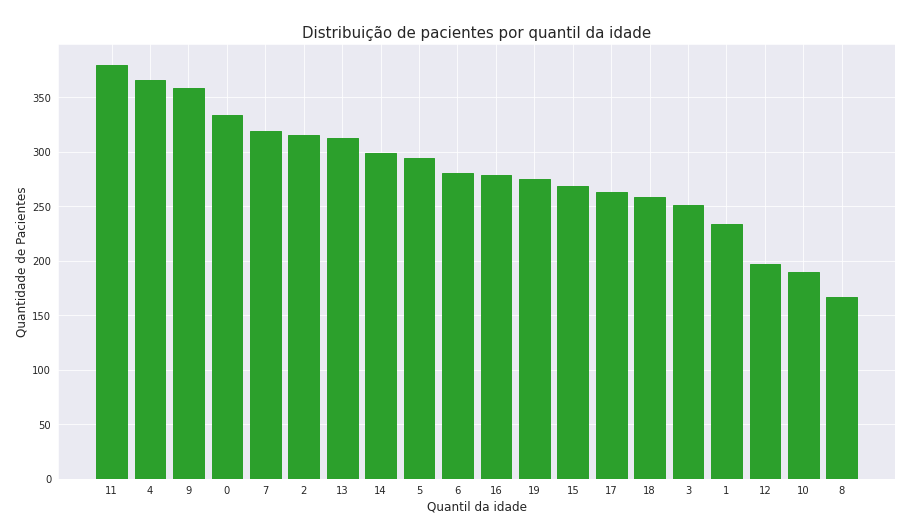
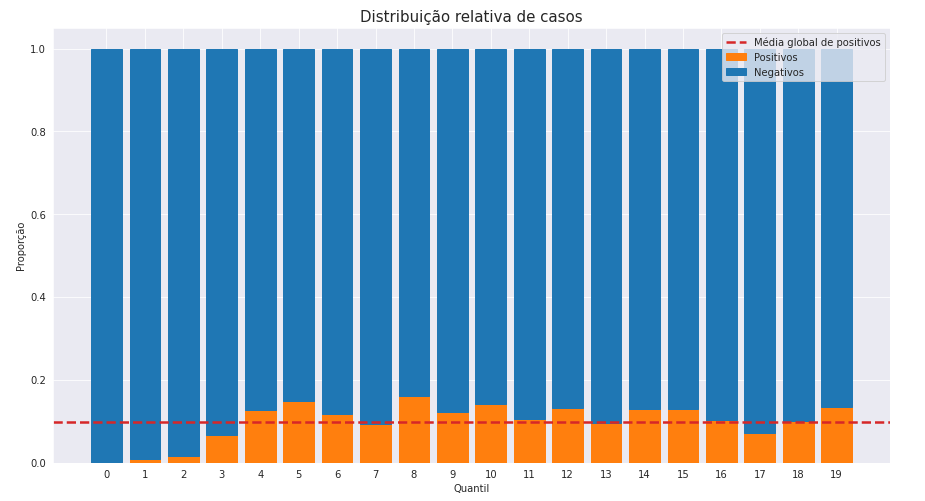
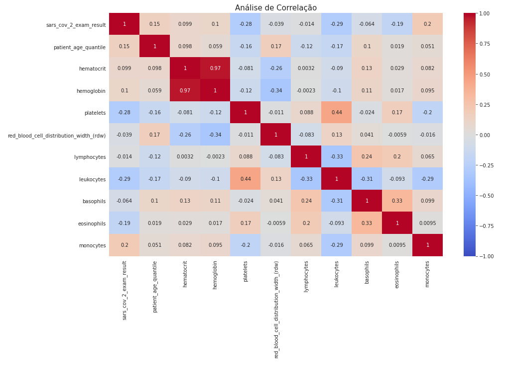

# Análise de Dados COVID19

Conheça um pouco mais sobre o COVID-19, um assunto tão atual e que mudou a vida de todos e provavelmente mudará ainda mais nos próximos meses. Vamos utilizar análise de dados para descobrir um pouco mais sobre o COVID-19. A mesma técnica pode ser utilizada para analisar processos e descobrir, com dados, a história real sobre o que acontece na sua empresa e porque ela tem os resultados que tem.

___

## Dados

Os dados que vamos analisar são do Hospital Israelita Albert Einstein de São Paulo. Esse conjunto de dados descreve 111 informações de 5644 pacientes que compareceram ao hospital entre os dias 28-03-2020 e 03-04-2020 e tiverão amostras coletadas para testes laboratoriais incluindo o teste SARS-CoV-2 RT-PCR.

Esses dados foram postados pela Einstein Data4u no [Kaggle](https://www.kaggle.com/). O Kaggle é uma plataforma de competições e disponiblização de dados para ciêntistas e analistas de dados e vale a pena tê-la nos seus favoritos. Os dados já foram vistos mais de 53 mil vezes, baixado 2446 vezes e 156 pessoas contribuiram com suas análises.

Obs.: os dados estão anonimizados, ou seja, informações sensíveis dos pacientes foram mascaradas para que não houvesse possibilidade de vazamento ou constragimento de qualquer paciente.

## Python

Para efetuar essa análise utilizaremos o Python. Python foi considerada a linguagem de programação mais fácil de se aprender, ela é muito utilizada por um gama de profissionais para fazer análise de dados, gerar gráficos e até criar inteligência artificial.

## Análise

O dataset possui uma estrutura tabular, ou seja, 'linhas x colunas' onde cada linha representa um paciente e cada coluna representa uma informação sobre esse paciente.

A primeira informação de destaque é a quantidade de pacientes que testaram positivo para COVID19. Podemos ver no gráfico abaixo de que somente 558 pessoas testaram positivo.

Normalizando essa distribuição de resultados encontramos que aproximadamente 90% dos pacientes testaram positivo e 10% negativo.

Quanto a idade, os pacientes foram divididos em 20 quantis. Ou seja, 20 grupos de idades igualmente distribuídas. E verificando o gráfico abaixo podemos concluir que a maior quantidade de pacientes estava no quantil 11.

Ainda no assunto idade, podemos fazer uma verificação rápida da proporção de resultados posivitos e negativos para cada quantil. O gráfico abaixo ainda demonstra, através da linha vermelha, os quantis com proporções de caso positivos acima da média global do dataset.

Analisando a amostra de pacientes que, no dataset, possuem dados de hemograma podemos verificar as correlações entre alguns fatores. Nosso dados não demonstram um relacionamento forte entre o resultado do teste de COVID e as outras variáveis da amostra.

